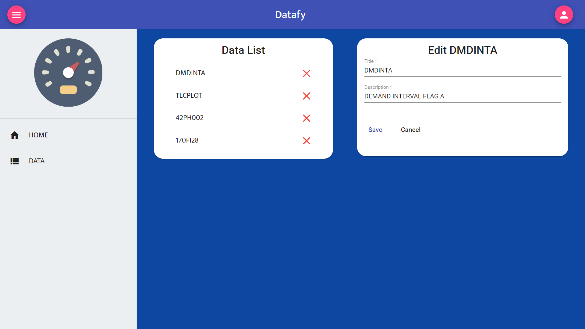
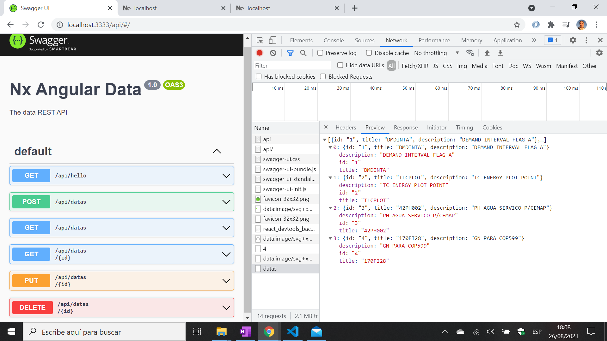

# :zap: Nx Angular Data

* Nx monorepo with Angular app to display data from a NestJS backend API
* **Note:** to open web links in a new window use: _ctrl+click on link_


## :page_facing_up: Table of contents

* [:zap: Nx Angular Data](#zap-nx-angular-data)
  * [:page_facing_up: Table of contents](#page_facing_up-table-of-contents)
  * [:books: General info](#books-general-info)
  * [:camera: Screenshots](#camera-screenshots)
  * [:signal_strength: Technologies](#signal_strength-technologies)
  * [:floppy_disk: Setup](#floppy_disk-setup)
  * [:computer: Code Examples](#computer-code-examples)
  * [:cool: Features](#cool-features)
  * [:clipboard: Status & To-do list](#clipboard-status--to-do-list)
  * [:clap: Inspiration](#clap-inspiration)
  * [:file_folder: License](#file_folder-license)
  * [:envelope: Contact](#envelope-contact)

## :books: General info

* Nx workspace for both front and backends

## :camera: Screenshots




## :signal_strength: Technologies

* [Nx v12](https://nx.dev) build framework used to create project workspace
* [Angular framework v12](https://angular.io/) for frontend tasks view
* [@angular/Material v12](https://material.angular.io/) Material components
* [Angular Material theming](https://material.angular.io/guide/theming)
* [Custom theme color generator](https://materialtheme.arcsine.dev/)
* [@ngrx/store](https://ngrx.io/guide/store) global state management
* [NestJS v7](https://nestjs.com/) for backend API
* [Nestjs mapped types v1](https://www.npmjs.com/package/@nestjs/mapped-types) module
* [@nestjs/swagger v4](https://www.npmjs.com/package/@nestjs/swagger) server-side framework
* [swagger-ui-express v4](https://www.npmjs.com/package/swagger-ui-express) to serve auto-generated swagger-ui generated API docs from express, based on a swagger.json file
* [uuid v8](https://www.npmjs.com/package/uuid) to create RFC4122 UUIDs

## :floppy_disk: Setup

* Install dependencies using `npm i`
* `npm run serve:web` for a frontend dev server on `http://localhost:4200/`
* `npm run serve:api` for a backend dev server running swagger UI
* `npm run serve:all` to run front and back ends concurrently

## :wrench: Testing

* tba

## :computer: Code Examples

* tba

```typescript

```

## :cool: Features

* monorepo organised libraries etc. makes for tidier code
* Swagger UI saves dev. time
## :clipboard: Status, To-Do List

* Status: Working
* To-Do: add to Readme, add comments

## :clap: Inspiration/General Tools

* [dreevo: Angular Production - Build, Test & Deploy a Full Stack Application using Nx - Part I](https://www.youtube.com/watch?v=j38ufd8Q86w&t=119s)
* [Nx documentation](https://nx.dev/angular)
* [Github solution: Fresh NX-Angular app does not build](https://github.com/nrwl/nx/issues/5682)

## :file_folder: License

* N/A

## :envelope: Contact

* Repo created by [ABateman](https://github.com/AndrewJBateman), email: gomezbateman@yahoo.com